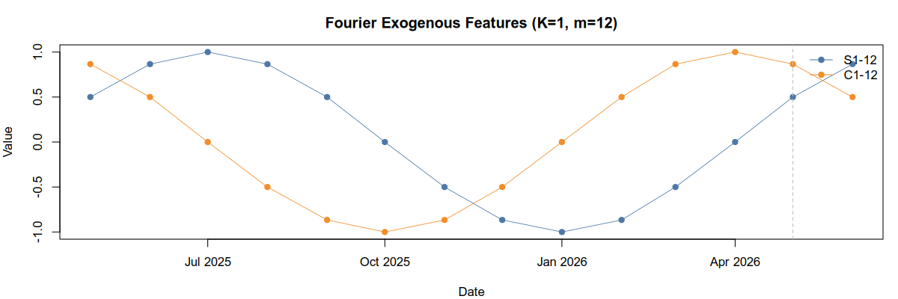
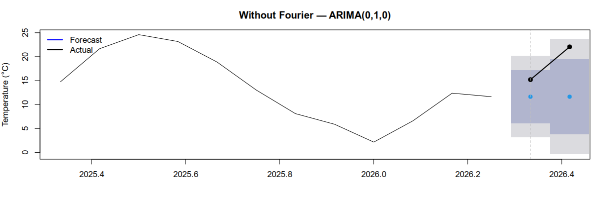
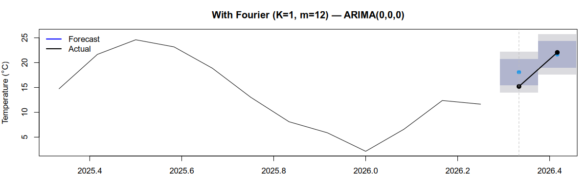

# Fourier Featurizer Example

This repo demonstrates how to use Fourier terms as exogenous regressors in an ARIMA model to capture seasonality, without necessarily having 24 months of data.

This is demonstrated using Denver daily temperature measurements, as this
data is easy to get and has strong seasonality.

## What is a Fourier feature?

A seasonal time series repeats on a fixed period - monthly temperature peaks every 12 months, for example. One way to model this is to give the ARIMA model a pair of sine and cosine terms that complete one full cycle over that period:

```
sin(2π · t / m)
cos(2π · t / m)
```

where `t` is the time index and `m` is the period (12 for monthly data with annual seasonality). Together, a sin/cos pair can represent a sinusoid of any phase and amplitude. Adding more pairs (controlled by `K`) adds more sine and cosine terms, with increasing frequency, which lets you represent a more "wiggly" seasonality period.

At k=1, we have a single sine and cosine term, that has frequency equal to the period. This can often capture most seasonal patterns, while only requiring two extra parameters, in contrast to the 12 that would be required by a full seasonal term.

Here is what these two exogenous features look like by themselves.



## Applying Fourier Features

Example of how to do this:

```
# ts_train is input time series
xreg_train <- fourier(ts_train, K = K)
xreg_test  <- fourier(ts_train, K = K, h = h)
fit <- auto.arima(ts_train, xreg = xreg_train, seasonal = FALSE)
fc  <- forecast(fit, xreg = xreg_test, h = h)
```

In this example, I'm plugging Fourier features into an ARIMA model, but you can use any model which supports exogenous features.

## Worked example with Denver temperature data

In this plot, I plot 14 months of Denver temperature data. The first 12 are used for training the ARIMA, and the last 2 are for forecasting.



Notice two things:
1. The prediction is quite bad, and the uncertainty intervals are wide.
2. `auto.arima()` prefers an ARIMA(0, 1, 0), with an integrated term.

Now, add Fourier features with k=1.



Notice two things:
1. The prediction is better.
2. `auto.arima()` now prefers a less complex ARIMA model - the input is less auto-correlated, so an additional integrated term provides less advantage.

## Overfit

If you set k to m/2, we have as many sine/cosine terms as we have periods in the season, and the result is equivalent to a seasonal term. You gain no benefit in terms of regularizing your model, so there is no point to setting k to 6 or above. You probably want a k value of 1 or 2.

## Key R functions

- [`forecast::auto.arima`](https://pkg.robjhyndman.com/forecast/reference/auto.arima.html) — automatically selects ARIMA order; accepts `xreg` for exogenous regressors
- [`forecast::fourier`](https://pkg.robjhyndman.com/forecast/reference/fourier.html) — generates the Fourier term matrix for a given `K` and period
- [`forecast::forecast`](https://pkg.robjhyndman.com/forecast/reference/forecast.html) — produces forecasts with confidence intervals from a fitted model
- [`stats::ts`](https://stat.ethz.ch/R-manual/R-devel/library/stats/html/ts.html) — creates a time series object with a specified frequency and start date

## Python version

I originally wrote this in Python and ported it to R. In Python, you could use FourierFeaturizer to accomplish the same thing.
